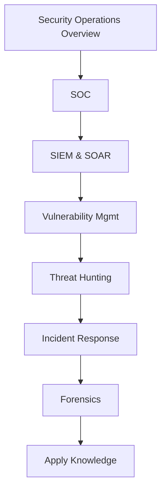

  
  
  
  

`SecKC.Academy`

Security learning materials curated by the SecKC community. A polished hub for exploring tracks, talks, transcripts, and NotebookLM notebooks built from public SecKC data since 2011.

## DataPipeline to Tracks at a glance

## Quick start

* **Browse curriculum docs:** [`curriculum_docs`](https://github.com/hakceracademy/seckc-academy-resources/tree/main/curriculum_docs)
* **Explore transcripts:** [`transcripts`](https://github.com/hakceracademy/seckc-academy-resources/tree/main/transcripts)
* **Allowed taxonomy:** [`allowed_categories.json`](https://github.com/hakceracademy/seckc-academy-resources/blob/main/allowed_categories.json)
* **Source dataset:** [`SecKC_Academy_Source_Data.csv`](https://github.com/hakceracademy/seckc-academy-resources/blob/main/SecKC_Academy_Source_Data.csv) or   

https://docs.google.com/spreadsheets/d/1zVUpkJXoEj5FDd2JmLUUOTsLIpDxtD6VomU5K5AaJJQ/edit?usp=sharing
* **NotebookLM collections per track:**

https://github.com/user-attachments/assets/504207ac-6aca-49aa-9de4-f0c548f9f8da

## Pick a track

| Track                | Start here                           | NotebookLM                                                                                                      | Curriculum                                                                                                                                                    |
| -------------------- | ------------------------------------ | --------------------------------------------------------------------------------------------------------------- | ------------------------------------------------------------------------------------------------------------------------------------------------------------- |
| Security Operations  | SOC, SIEM & SOAR, Vulnerability Mgmt | [Security Ops Notebook](https://notebooklm.google.com/notebook/eee91e6d-e404-41ba-ab18-20e5c2a5d32f?authuser=3) | [`security_operations_curriculum.md`](https://github.com/hakceracademy/seckc-academy-resources/blob/main/curriculum_docs/security_operations_curriculum.md)   |
| Application Security | Shift Left, CICD, Code Review        | [AppSec Notebook](https://notebooklm.google.com/notebook/e8885f1b-5392-44b1-94cc-ac07e840be05?authuser=3)       | [`application_security_curriculum.md`](https://github.com/hakceracademy/seckc-academy-resources/blob/main/curriculum_docs/application_security_curriculum.md) |
| Threat Intelligence  | External, Internal, Contextual       | [Threat Intel Notebook](https://notebooklm.google.com/notebook/TODO_cti)                                        | [`threat_intelligence_curriculum.md`](https://github.com/hakceracademy/seckc-academy-resources/blob/main/curriculum_docs/threat_intelligence_curriculum.md)   |
| More tracks          | See all                              | Mixed                                                                                                           | [`curriculum_docs`](https://github.com/hakceracademy/seckc-academy-resources/tree/main/curriculum_docs)                                                       |

> **Tip:** Each dataset row links talks, transcripts, and videos. Example: [Digital Apiaries – Noah](https://www.youtube.com/watch?v=p2DmpLR8eQI) with its [transcript](https://github.com/hakceracademy/seckc-academy-resources/blob/main/transcripts/p2DmpLR8eQI.txt).

---

## Interactive mindmaps per track

Mermaid renders beautifully in GitHub. Each curriculum doc includes its own track flow. Example for Security Operations:

---

## How the data is built

* Wayback crawls of seckc.org pages (2011 forward)
* YouTube index with transcripts
* Merge scripts reconcile titles, speakers, and topics
* Allowed taxonomy enforces a clean category mapping
* NotebookLM ingests repository data and transcripts for research

Contribution guide and scripts live at:

* [`hakceracademy/seckc-academy-resources`](https://github.com/hakceracademy/seckc-academy-resources)
* PRs welcome for new talks, improvements, and links
