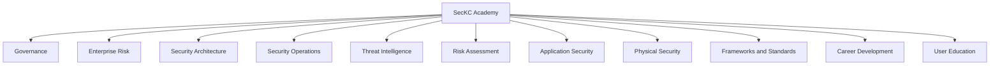
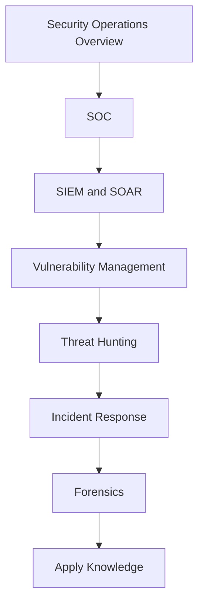

# SecKC Academy

Security learning materials from the SecKC community. Single place to explore tracks, talks, transcripts, and NotebookLM notebooks built from public SecKC data since 2011.

## Quick start

- Browse curriculum docs: [`seckc-academy-resources/curriculum_docs`](https://github.com/hakceracademy/seckc-academy-resources/tree/main/curriculum_docs)
- Explore transcripts: [`seckc-academy-resources/transcripts`](https://github.com/hakceracademy/seckc-academy-resources/tree/main/transcripts)
- Allowed taxonomy: [`allowed_categories.json`](https://github.com/hakceracademy/seckc-academy-resources/blob/main/allowed_categories.json)
- Source dataset: [`SecKC_Academy_Source_Data.csv`](https://github.com/hakceracademy/seckc-academy-resources/blob/main/SecKC_Academy_Source_Data.csv)
- NotebookLM collections per track:
  - Governance: <https://notebooklm.google.com/notebook/TODO_governance>
  - Security Operations: <https://notebooklm.google.com/notebook/TODO_secops>
  - Application Security: <https://notebooklm.google.com/notebook/TODO_appsec>
  - Threat Intelligence: <https://notebooklm.google.com/notebook/TODO_cti>
  - Add more as you publish

## Tracks at a glance

## Pick a track

| Track | Start here | NotebookLM | Curriculum |
|------|------------|------------|------------|
| Governance | Policies and Standards, Compliance | <https://notebooklm.google.com/notebook/TODO_governance> | [`governance_curriculum.md`](https://github.com/hakceracademy/seckc-academy-resources/blob/main/curriculum_docs/governance_curriculum.md) |
| Security Operations | SOC, SIEM and SOAR, Vulnerability Mgmt | <https://notebooklm.google.com/notebook/TODO_secops> | [`security_operations_curriculum.md`](https://github.com/hakceracademy/seckc-academy-resources/blob/main/curriculum_docs/security_operations_curriculum.md) |
| Application Security | Shift Left and CICD, Code Review | <https://notebooklm.google.com/notebook/TODO_appsec> | [`application_security_curriculum.md`](https://github.com/hakceracademy/seckc-academy-resources/blob/main/curriculum_docs/application_security_curriculum.md) |
| Threat Intelligence | External, Internal, Contextual | <https://notebooklm.google.com/notebook/TODO_cti> | [`threat_intelligence_curriculum.md`](https://github.com/hakceracademy/seckc-academy-resources/blob/main/curriculum_docs/threat_intelligence_curriculum.md) |
| More tracks | See all | Mixed | [`curriculum_docs`](https://github.com/hakceracademy/seckc-academy-resources/tree/main/curriculum_docs) |

## Interactive mindmaps per track

Mermaid renders in GitHub Markdown. Each curriculum doc includes a track flow. Example for Security Operations:

## How the data is built

- Wayback crawls of seckc.org pages from 2011 forward
- YouTube channel index with transcripts when available
- Merge scripts reconcile titles, speakers, topics, and links
- Allowed taxonomy applies a constrained category mapping
- NotebookLM reads from the public repo data and transcripts to power research

Contrib guide and scripts live in:
- [`hakceracademy/seckc-academy-resources`](https://github.com/hakceracademy/seckc-academy-resources)
- PRs welcome for new talks, fixes, and links
